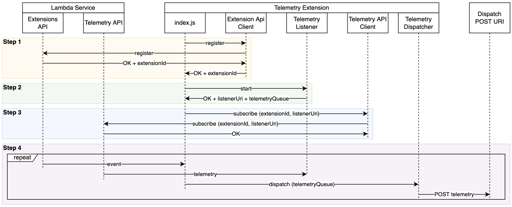

1. instal packages
```bash
cd nodejs-example-logs-api-extension
chmod +x index.js
npm install
cd ..
```

2. create extension.zip
```bash
chmod +x extensions/nodejs-example-telemetry-api-extension
zip -r extension.zip ./nodejs-example-telemetry-api-extension
zip -r extension.zip ./extensions
```

3. upload a extension.zip file as a layer in the AWS console

4. attach a layer to the lambda


